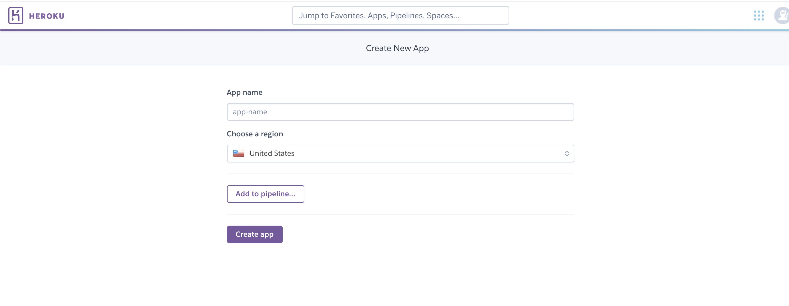
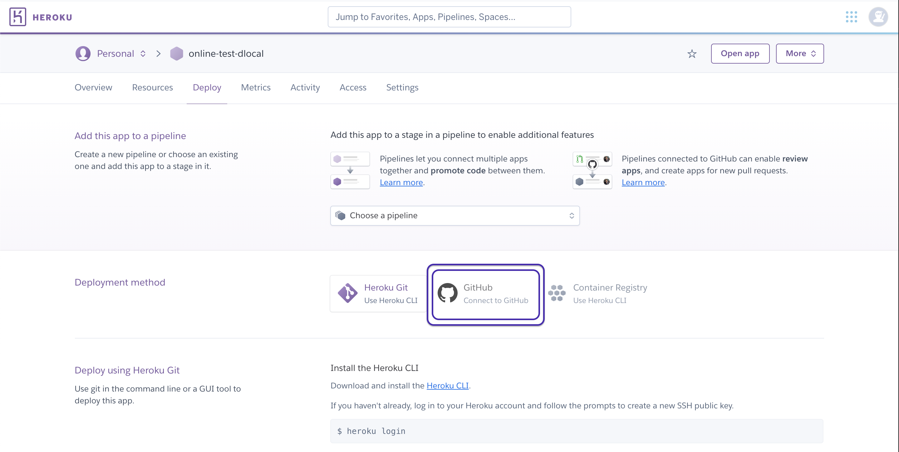
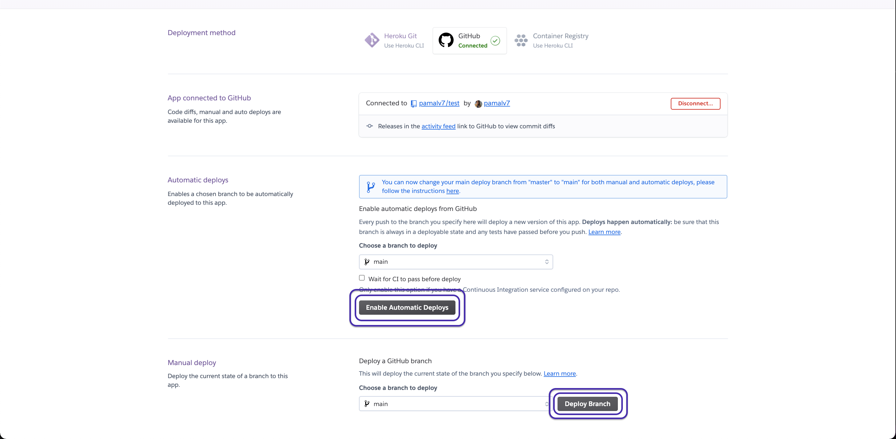

# Welcome to dLocal testing exercise!

## Initial configurations 

Following these instructions, you can use Heroku platform which will provide you with a simple way to deploy an application. 
You only have to login with your GitHub account and it will be ready to use.

## Requirements for the integration

- Account on [GitHub](https://github.com/login).
- Account on [Heroku](https://www.heroku.com/).

## Deploy your store 

- First, make a fork of this project. Considering that your GitHub user is your username.
- Then, log in to your Heroku account and create an application to deploy our e-commerce using the fork that you've already created in your GitHub account. 

 
- Connect your GitHub account and search for the fork repository to connect to. 

- Click on "Enable Automatic Deploys" for authorize any changes in the 'master' branch annd deploy manually, using the "Deploy branch" option to check that the app is working properly.

### And done! Your initial configuration is complete. 
